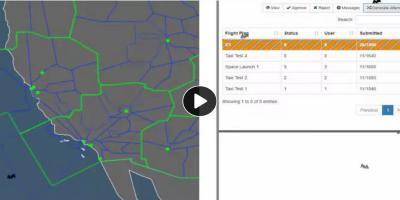

# js-bats

🦇🎃 Add some flying bats on your website with a small JS file and a single line of code.  

Based on the work of [Eric Grange at DelphiTools](https://www.delphitools.info/2013/10/30/pimp-your-website-with-an-halloween-bat/).

## Usage

First, include the script in your HTML header or footer.  You can use the JS file in this repo. e.g.,

``

Or, you can link to our hosted version.

``

Then, call makeBats() somewhere in your JS and give it the number of bats you want to appear. e.g.,

`new BatManager().makeBats(15)`

See the index.html file in this repo for an example.

## See A Video

